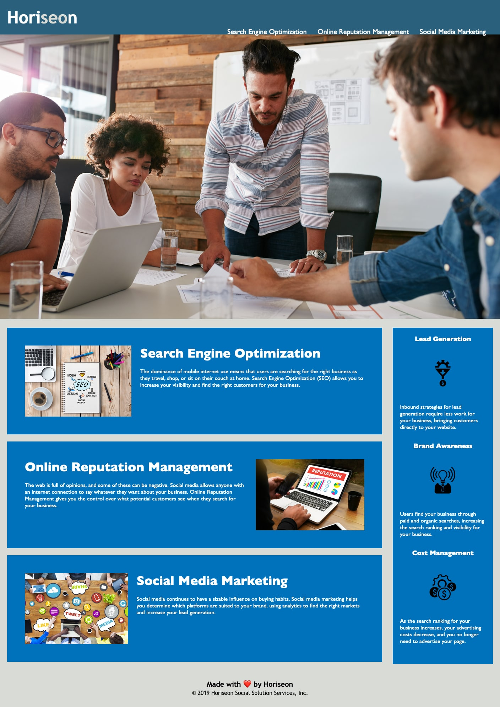

# A Search-Optimized and Accessible Webpage

## Description
The current code for a Marketing Agency's webpage had few semantic HTML elements, was not logically structured, had instances of broken code, and a lack of accessibility (e.g., alt text for screen readers). The version of the webpage in this repository has an improved structure, working links, better accessibility and includes heavily commented HTML and CSS.

[Optimized Horiseon Webpage](https://garylange.github.io/horiseon-accessibility-seo/)

